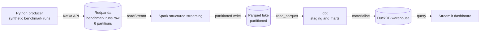

# chip-benchmark-pipeline

[](https://github.com/Varun1619/chip-benchmark-pipeline/actions/workflows/ci.yml)
[](https://github.com/Varun1619/chip-benchmark-pipeline/actions/workflows/docker-build.yml)

A streaming pipeline for synthetic chip and system benchmark telemetry. It
generates SPEC and MLPerf style benchmark runs across four workload categories,
ingests them through Redpanda, writes a partitioned Parquet lake with Spark
structured streaming, models them with dbt on DuckDB, and serves the results in
a Streamlit dashboard.

The whole stack runs locally under docker compose and uses no paid services.

## What it answers

Benchmark telemetry is only useful if it answers questions about the silicon.
The analytics layer targets three:

Which configuration wins on performance per watt, rather than on raw throughput,
so a part that scores well only by burning power does not top the table.

Which configuration and workload pairs have regressed against their own rolling
baseline, measured as a z-score and a percent deviation so a small absolute
change on a stable benchmark still registers.

How results vary run to run, so a regression can be separated from noise instead
of being read off a single sample.

## Architecture



Each stage is a separate container, so any one of them can be restarted or
replaced without touching the others. See [docs/architecture.md](docs/architecture.md)
for the design decisions behind each hop.

## Stack

| Layer | Tool | Why this one |
| --- | --- | --- |
| Ingestion | Redpanda | Kafka API without ZooKeeper or a JVM broker, so a single container is a realistic broker |
| Stream processing | PySpark structured streaming | Checkpointed, restartable reads from Kafka and the same API used on real clusters |
| Lake | Parquet | Columnar, partitioned, readable by DuckDB with no load step |
| Warehouse | DuckDB | In process, no server, and the file can be committed for a hosted dashboard |
| Transform | dbt-duckdb | Versioned SQL models with tests and lineage instead of ad hoc scripts |
| Serving | Streamlit | Reads DuckDB directly and deploys free on Streamlit Community Cloud |

## The synthetic data

Results are derived, not drawn at random. Throughput comes from the capability
of the block that bottlenecks the benchmark, power from the part's TDP and
process node, and latency from throughput and batch size. Relationships that
hold in silicon therefore hold in the data, which is what makes the analytics
worth building.

The catalogue has 8 configurations across mobile, edge, and datacenter parts,
and 17 benchmarks across the four workload categories. One part appears twice
with different memory, so a memory effect can be separated from a part effect.

Four effects are injected on purpose, so the analytics layer has something real
to find:

Run to run noise, lognormal at roughly 3.5 percent, so a single sample never
settles whether something regressed.

Thermal throttling, weighted by segment, workload intensity, and duration.
Mobile parts on sustained graphics work throttle most, which drops throughput
while temperature and power rise.

Driver attributed regressions and improvements. Each is narrow, hitting one SoC
family and one benchmark from one driver version onward, so it disappears in an
aggregate over everything and only shows up when the data is cut properly.

Failed and timed out runs carrying no measurements, at roughly 2 percent, so the
models have to handle nulls instead of assuming every row has a score.

The generator is seeded, so `PRODUCER_SEED` reproduces a stream exactly. Each
message is keyed by `config_id`, which keeps every run for a configuration on
one partition and in order, which is what the rolling baselines depend on.

At startup the producer backfills `PRODUCER_BACKFILL_DAYS` of history before
switching to live publishing, so the dashboard has trends on first load rather
than after a day of waiting.

## Ingestion and the lake

The consumer reads the topic with Spark structured streaming and writes Parquet
partitioned by `run_date`. Two queries run against one topic read. Usable runs go
to the lake, and records that cannot be parsed go to a quarantine path with their
raw bytes and a reason, because a silently dropped record is a silently wrong
dashboard. Each query has its own checkpoint, so both recover independently.

Measured on a 45 day backfill: 366328 records ingested, 169 Parquet files
averaging 275 KB, batches completing inside the 30 second trigger at over 7000
rows per second.

Two properties of the data that the models have to handle rather than assume
away, both documented in [docs/architecture.md](docs/architecture.md):

Records repeat. Kafka delivers at least once, and a restarted producer replays
its seeded backfill. Deduplication happens in dbt staging on `run_id`, so the
lake stays a faithful record of what arrived.

Comparisons need a fine grain. `batch_size` and `precision` move throughput
further than a regression does, and thermal throttling moves it further still, so
a baseline is built per configuration, benchmark, precision, and batch size, with
throttled runs held out.

## Quickstart

Requires Docker Desktop or Docker Engine with compose v2. Nothing else needs to
be installed to run the stack.

```bash
cp .env.example .env
docker compose up -d --build
```

Redpanda comes up first, then an init container creates the topic and exits, and
the producer and consumer wait for it to finish before starting.

| Service | URL |
| --- | --- |
| Dashboard | http://localhost:8501 |
| Spark UI | http://localhost:4040 |
| Kafka API from the host | localhost:19092 |

Add the topic browser when you want to inspect messages:

```bash
docker compose --profile console up -d redpanda-console
```

Stop everything and discard the broker volume:

```bash
docker compose down -v
```

If a port is already taken, override it in `.env` rather than editing the
compose file. Container side ports never move, so only the host side changes.

With GNU make available, `make help` lists the same operations as short targets.
On Windows the targets need Git Bash or WSL, since they call `grep` and `awk`.

## Configuration

Every service reads the same variables through one settings model in
[src/common/config.py](src/common/config.py), so a single `.env` drives the whole
stack. The lake, checkpoint, and warehouse paths all derive from `DATA_ROOT`
instead of being set per service.

| Variable | Default | Purpose |
| --- | --- | --- |
| `REDPANDA_BROKERS` | `redpanda:9092` | Bootstrap servers. Use `localhost:19092` when running a service on the host |
| `BENCHMARK_TOPIC` | `benchmark.runs.raw` | Topic carrying raw benchmark runs |
| `PRODUCER_EVENTS_PER_SECOND` | `25` | Target publish rate |
| `PRODUCER_SEED` | `42` | Generator seed, so a run can be reproduced exactly |
| `PRODUCER_MAX_EVENTS` | `0` | Stop after this many events. 0 produces until stopped |
| `DATA_ROOT` | `/data` | Root of the lake, warehouse, and checkpoints |
| `SPARK_TRIGGER_INTERVAL` | `30 seconds` | Processing time trigger for the streaming query |

Host ports (`REDPANDA_HOST_PORT`, `REDPANDA_ADMIN_PORT`, `SPARK_UI_PORT`,
`CONSOLE_PORT`, `DASHBOARD_PORT`) are listed in `.env.example`.

## Repository layout

```
.github/workflows/     ci (lint, types, tests) and docker-build (image matrix)
docker/                one Dockerfile per service image
src/common/            settings model shared by every service
src/producer/          synthetic generator and Redpanda producer
src/consumer/          Spark structured streaming job
src/dashboard/         Streamlit app
tests/                 unit tests
data/                  lake, warehouse and checkpoints (gitignored)
docs/                  architecture notes and screenshots
```

## Development

Python 3.11 is required for local work, because PySpark 3.5 does not support
3.13. Dependencies live in `pyproject.toml` with one extra per service, so each
image installs only what it runs.

```bash
python -m venv .venv
source .venv/bin/activate        # Windows: .venv\Scripts\activate
pip install -e ".[dev]"
```

Then run the same four checks CI runs:

```bash
ruff check . && ruff format --check . && mypy && pytest
```

## Build status

The repository is built in phases, each on its own branch. This table states
what runs today.

| Phase | Branch | Delivers | Status |
| --- | --- | --- | --- |
| 1 | `feat/scaffold` | Repo layout, shared settings, compose stack, images, CI | Done |
| 2 | `feat/producer` | Synthetic benchmark generator and Redpanda producer | Done |
| 3 | `feat/spark-consumer` | Structured streaming job writing partitioned Parquet | Done |
| 4 | `feat/dbt-models` | Staging and mart models, regression detection, leaderboard | Not started |
| 5 | `feat/dashboard` | Streamlit app on DuckDB | Not started |
| 6 | `feat/deploy-docs` | Hosted dashboard, screenshots, results, contributor docs | Not started |

Phase 1 was validated by building all three images, confirming Spark resolves
its vendored Kafka connector jars with no Maven access, and checking that
Redpanda reports healthy and the topic is created with six partitions.

## License

MIT. See [LICENSE](LICENSE).
