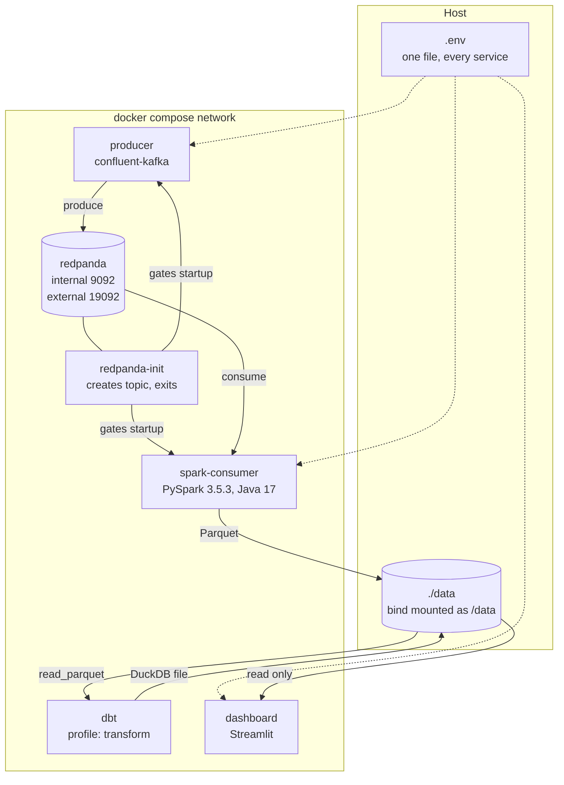

# Architecture

This document covers the design decisions behind each hop in the pipeline. The
README has the diagram and the quickstart.

## Component view



## Why each choice

### Redpanda instead of Kafka

Redpanda speaks the Kafka API, so the producer uses `confluent-kafka` and Spark
uses `spark-sql-kafka-0-10` exactly as they would against a real cluster. It runs
as one container with no ZooKeeper or KRaft controller to configure, which keeps
the local stack honest without making it heavy.

### The topic is created by an init container

`redpanda-init` runs `rpk topic create` with six partitions and then exits. Two
reasons it exists rather than relying on auto-create:

Auto-create produces a single partition topic. A single partition caps the Spark
consumer at one reader no matter how many cores it has, which hides the
partitioning behaviour the pipeline is meant to demonstrate.

Startup ordering needs a gate. The producer and consumer both declare
`depends_on: redpanda-init` with `condition: service_completed_successfully`, so
neither starts before the topic exists. Redpanda itself is gated by a healthcheck
that shells out to `rpk cluster health`.

The create command falls back to `rpk topic describe` instead of `|| true`. That
keeps a restart idempotent, since the init container must still exit 0 for the
readiness gate to hold, while a genuine broker failure still surfaces as a
non-zero exit.

### Messages are keyed by configuration, and that skews the partitions

Every run is published with `config_id` as the key, so all runs for a
configuration land on one partition and stay in order. The rolling baselines
in the analytics layer read a per configuration history, and ordering is
cheaper to preserve here than to restore later.

The cost is uneven partitions. With 8 configurations and 6 partitions, the
default murmur2 hash puts every key on 4 of them and leaves 2 empty, which a
run of the stack confirms. That is the accepted trade: ordering per key matters
more than balance at this cardinality, and adding parts to the catalogue
spreads the load without any change to the topic.

### One settings model, not four

`src/common/config.py` holds a single `pydantic-settings` model. Every service
reads the same variable names, so one `.env` drives the stack whether it runs
under compose or a component is started directly on the host.

Paths are derived rather than configured. `DATA_ROOT` is the only storage
variable, and the lake, checkpoint, and warehouse locations hang off it as
properties. A per service path variable would let the consumer write where the
dbt project does not read.

### Kafka jars are vendored into the image

The Spark image downloads four jars at build time and copies them into the
PySpark installation: `spark-sql-kafka-0-10`, `spark-token-provider-kafka-0-10`,
`kafka-clients`, and `commons-pool2`. Versions are build args pinned to match
PySpark 3.5.3.

Passing `--packages` at submit time is the more common approach, but it makes
every container start depend on Maven Central and on a writable Ivy cache. A
vendored image starts offline and starts the same way every time.

### Base images pin Debian bookworm

`python:3.11-slim` now tracks Debian trixie, which dropped `openjdk-17` in favour
of 21. Spark 3.5 supports Java 8, 11, and 17, so all three images pin
`python:3.11-slim-bookworm`. That also stops the build drifting when Debian
promotes a new stable release.

Python is pinned to 3.11 for the same class of reason: PySpark 3.5 does not
support 3.13.

### dbt shares the dashboard image

Both dbt and Streamlit talk to the same DuckDB file, and neither needs Spark or a
Kafka client. One image covers both, with dbt running on demand behind the
`transform` compose profile rather than as a long lived service.

### Host ports come from the environment

Every published port reads from a variable with a default. Container side ports
never change, so overriding a host port in `.env` moves nothing internal. This
keeps a clone from failing on `port is already allocated`, which is likely on any
machine already running a broker or another Spark job.

## Storage layout

```
/data
├── lake/
│   └── benchmark_runs/     partitioned Parquet, written by the consumer
├── checkpoints/
│   └── benchmark_runs/     structured streaming checkpoint and write ahead log
├── warehouse/
│   └── benchmarks.duckdb   built by dbt, read by the dashboard
└── sample/                 committed snapshot for the hosted dashboard
```

`data/` is gitignored apart from `.gitkeep` and `data/sample/`. The sample
directory holds a small committed DuckDB file so the Streamlit Community Cloud
deployment has something to read without a broker.

The checkpoint directory is what makes the streaming job restartable. Deleting it
makes the next run reprocess the topic from its configured starting offsets, so
`docker compose down -v` and a manual wipe of `data/` are different operations
with different consequences.

## Delivery order

Each phase is a branch off `main`, merged with a non fast forward merge commit so
a phase reads as one unit in the history.

| Phase | Branch | Scope |
| --- | --- | --- |
| 1 | `feat/scaffold` | Layout, settings model, compose stack, images, CI |
| 2 | `feat/producer` | Benchmark record schema and the synthetic generator |
| 3 | `feat/spark-consumer` | Streaming read, schema enforcement, partitioned write |
| 4 | `feat/dbt-models` | Staging models, rolling baselines, regression detection, leaderboard |
| 5 | `feat/dashboard` | Streamlit views over the marts |
| 6 | `feat/deploy-docs` | Hosted deployment, screenshots, results, contributor docs |

## What the lake is partitioned by, and why only by date

The first working run partitioned by `run_date` and `workload_category`. That
produced 1819 Parquet files averaging 33 KB across 234 directories for 59 MB of
data, and a micro-batch took over 20 minutes against a host bind mount, with the
streaming metadata log alone taking 29 seconds to compact.

Partitioning by date only, and repartitioning on that column before the write so
each date gets one file per batch, brought the same data to 169 files averaging
275 KB. Category remains a normal column, so nothing downstream loses the ability
to filter on it. At this volume a second partition level multiplies directory
count by four and prunes nothing worth having.

Checkpoints also moved off the bind mount into a container volume. Nobody
inspects them, and the metadata log is rewritten constantly, so paying host
filesystem costs for it buys nothing.

## The grain a comparison has to use

Measured on generated data, the things that move a throughput number, largest
first:

| Factor | Effect on throughput |
| --- | --- |
| `batch_size` | up to 2x |
| `precision` | up to 3.1x |
| Thermal throttling | around 18 percent |
| An injected driver regression | 13 percent |
| Run to run noise | 3.5 percent |

The signal a performance team cares about is fourth on that list. Aggregating a
family and a benchmark across precisions and batch sizes showed a 13 percent
regression as a 2.6 percent dip, while a benchmark with nothing wrong with it
swung 40 percent purely on batch mix.

Holding configuration, benchmark, precision, and batch size fixed, an unaffected
benchmark is stable within about 2 percent across every driver version, and the
regression shows up at its true size in the version it was introduced in.

Two consequences for the models:

The baseline grain is `config_id`, `benchmark_name`, `precision`, `batch_size`.
Anything coarser mixes populations and hides real regressions.

Throttled runs are excluded from the baseline rather than averaged into it.
Throttling moves a result further than the regression does, so leaving it in
means the baseline tracks cooling conditions instead of performance.

## Why there are two regression detectors

`fct_run_baselines` scores each run against a rolling window of its own recent
history. It is the right shape for "did something just change", and it is what
most tutorials stop at.

It is not sufficient. A rolling baseline detects a change, not a state. Once
about 30 regressed runs accumulate, the window contains only regressed runs, the
baseline has dropped to match, and the z-score returns to zero. Measured on
generated data with four known effects present, it raised one alert, for the
sharpest, and missed the other three entirely.

`mart_driver_comparison` compares each cell's median against a fixed reference,
its own median on the previous driver version. That found all four effects at
their designed magnitude, with no false positives across 638 unaffected cells.

Both are kept. The rolling model catches a change the moment it appears, and the
version model tells you what a release broke and whether it is still broken.

## Duplicates are expected, and removed in staging

A measured lake held 366328 rows for 280518 distinct `run_id` values. Two causes,
both normal. Kafka delivery is at least once, and a restarted producer replays
its seeded backfill, which is a deliberate property of a reproducible generator.

Deduplication belongs in the dbt staging layer, keyed on `run_id`, rather than in
the consumer. The lake stays a faithful record of what arrived, and the models
present one row per run.
