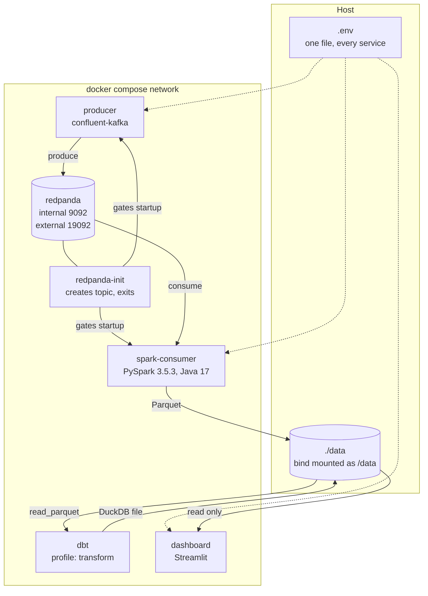

# Architecture

This document covers the design decisions behind each hop in the pipeline. The
README has the diagram and the quickstart.

## Component view



## Why each choice

### Redpanda instead of Kafka

Redpanda speaks the Kafka API, so the producer uses `confluent-kafka` and Spark
uses `spark-sql-kafka-0-10` exactly as they would against a real cluster. It runs
as one container with no ZooKeeper or KRaft controller to configure, which keeps
the local stack honest without making it heavy.

### The topic is created by an init container

`redpanda-init` runs `rpk topic create` with six partitions and then exits. Two
reasons it exists rather than relying on auto-create:

Auto-create produces a single partition topic. A single partition caps the Spark
consumer at one reader no matter how many cores it has, which hides the
partitioning behaviour the pipeline is meant to demonstrate.

Startup ordering needs a gate. The producer and consumer both declare
`depends_on: redpanda-init` with `condition: service_completed_successfully`, so
neither starts before the topic exists. Redpanda itself is gated by a healthcheck
that shells out to `rpk cluster health`.

The create command falls back to `rpk topic describe` instead of `|| true`. That
keeps a restart idempotent, since the init container must still exit 0 for the
readiness gate to hold, while a genuine broker failure still surfaces as a
non-zero exit.

### One settings model, not four

`src/common/config.py` holds a single `pydantic-settings` model. Every service
reads the same variable names, so one `.env` drives the stack whether it runs
under compose or a component is started directly on the host.

Paths are derived rather than configured. `DATA_ROOT` is the only storage
variable, and the lake, checkpoint, and warehouse locations hang off it as
properties. A per service path variable would let the consumer write where the
dbt project does not read.

### Kafka jars are vendored into the image

The Spark image downloads four jars at build time and copies them into the
PySpark installation: `spark-sql-kafka-0-10`, `spark-token-provider-kafka-0-10`,
`kafka-clients`, and `commons-pool2`. Versions are build args pinned to match
PySpark 3.5.3.

Passing `--packages` at submit time is the more common approach, but it makes
every container start depend on Maven Central and on a writable Ivy cache. A
vendored image starts offline and starts the same way every time.

### Base images pin Debian bookworm

`python:3.11-slim` now tracks Debian trixie, which dropped `openjdk-17` in favour
of 21. Spark 3.5 supports Java 8, 11, and 17, so all three images pin
`python:3.11-slim-bookworm`. That also stops the build drifting when Debian
promotes a new stable release.

Python is pinned to 3.11 for the same class of reason: PySpark 3.5 does not
support 3.13.

### dbt shares the dashboard image

Both dbt and Streamlit talk to the same DuckDB file, and neither needs Spark or a
Kafka client. One image covers both, with dbt running on demand behind the
`transform` compose profile rather than as a long lived service.

### Host ports come from the environment

Every published port reads from a variable with a default. Container side ports
never change, so overriding a host port in `.env` moves nothing internal. This
keeps a clone from failing on `port is already allocated`, which is likely on any
machine already running a broker or another Spark job.

## Storage layout

```
/data
├── lake/
│   └── benchmark_runs/     partitioned Parquet, written by the consumer
├── checkpoints/
│   └── benchmark_runs/     structured streaming checkpoint and write ahead log
├── warehouse/
│   └── benchmarks.duckdb   built by dbt, read by the dashboard
└── sample/                 committed snapshot for the hosted dashboard
```

`data/` is gitignored apart from `.gitkeep` and `data/sample/`. The sample
directory holds a small committed DuckDB file so the Streamlit Community Cloud
deployment has something to read without a broker.

The checkpoint directory is what makes the streaming job restartable. Deleting it
makes the next run reprocess the topic from its configured starting offsets, so
`docker compose down -v` and a manual wipe of `data/` are different operations
with different consequences.

## Delivery order

Each phase is a branch off `main`, merged with a non fast forward merge commit so
a phase reads as one unit in the history.

| Phase | Branch | Scope |
| --- | --- | --- |
| 1 | `feat/scaffold` | Layout, settings model, compose stack, images, CI |
| 2 | `feat/producer` | Benchmark record schema and the synthetic generator |
| 3 | `feat/spark-consumer` | Streaming read, schema enforcement, partitioned write |
| 4 | `feat/dbt-models` | Staging models, rolling baselines, regression detection, leaderboard |
| 5 | `feat/dashboard` | Streamlit views over the marts |
| 6 | `feat/deploy-docs` | Hosted deployment, screenshots, results, contributor docs |

## Decisions still open

The benchmark record schema is defined in Phase 2. It sets the partition columns
for the lake, which in turn constrain the dbt models, so it is settled before the
generator is written rather than after.

Regression detection in Phase 4 compares each run against a rolling baseline for
its own configuration and workload pair, reporting both a z-score and a percent
deviation. The baseline window length and the alert thresholds are chosen once
there is generated data to look at.
